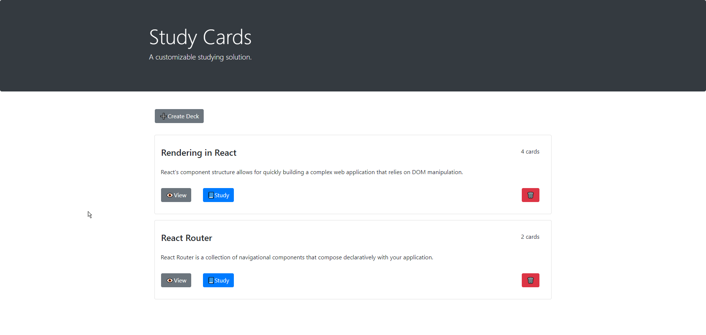
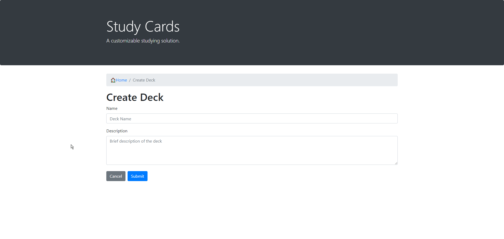
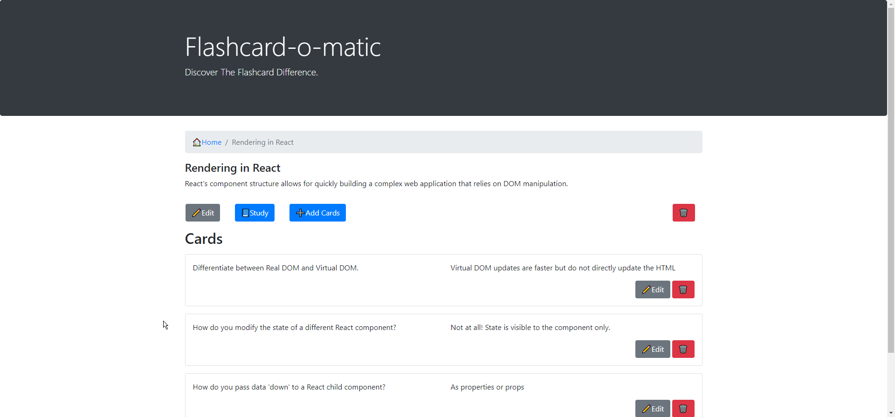
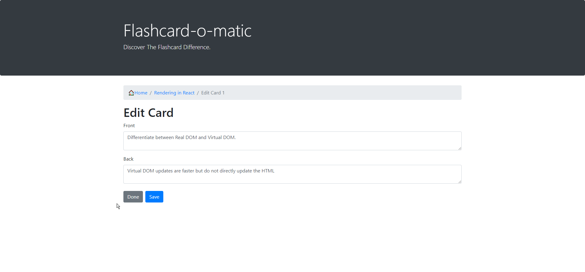
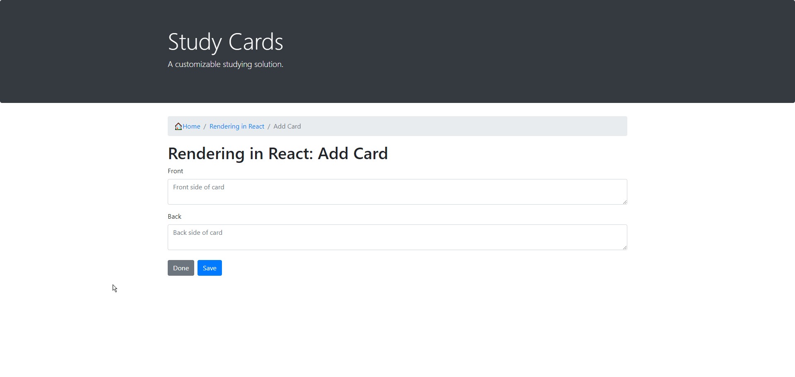
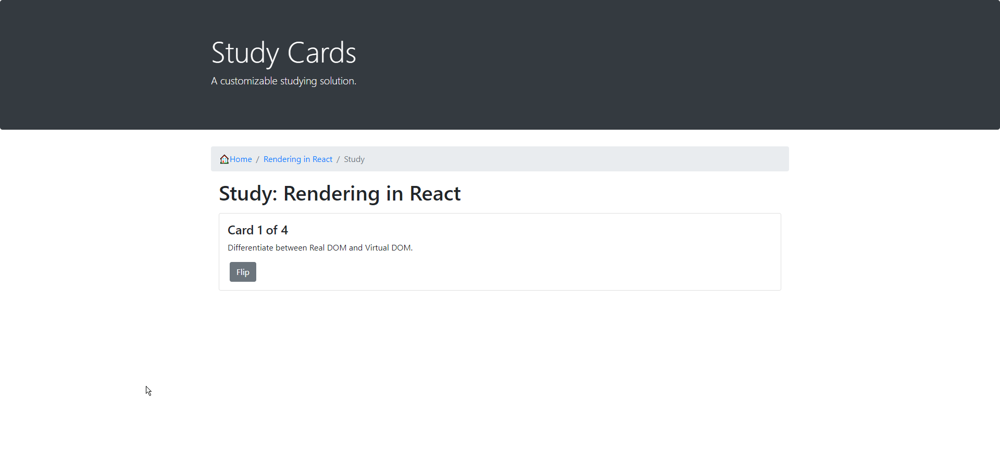
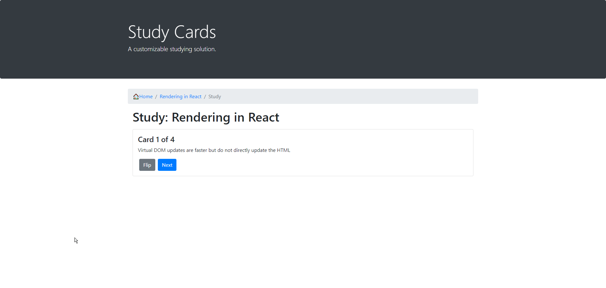
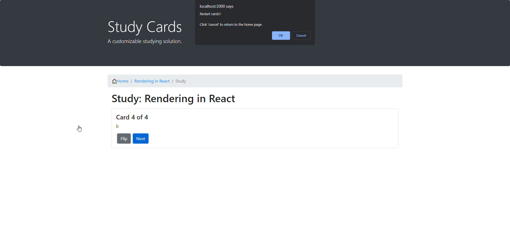
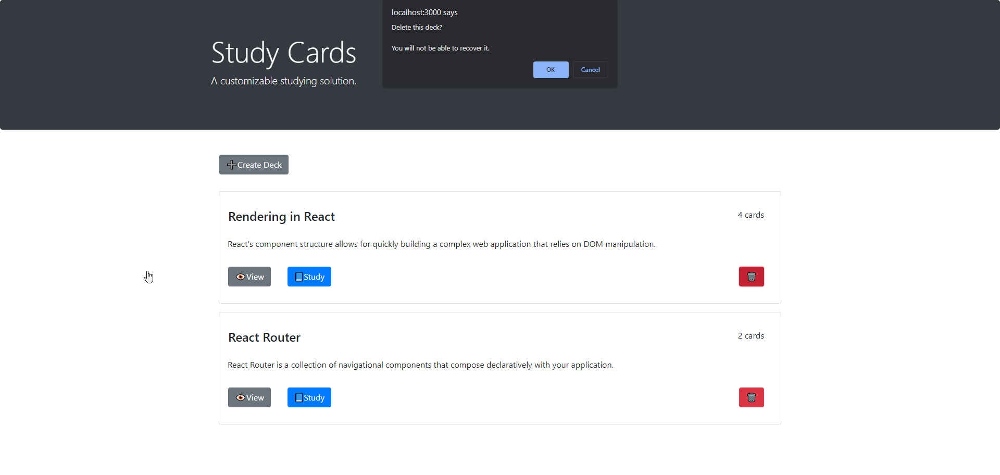

# Study Cards
Users can create a deck, add, edit, or delete study cards, and study decks of cards.

---
## Features:
 - create/delete decks
 - add/remove/edit cards to/from/in decks
 - view decks in a list
 - select a deck to study
    - flip through deck 1 card at a time, front then back
    - this can be repeated as many times as the user would like

## Technologies & Tools
- JavaScript
- HTML
- Bootstrap
- CSS

## Screenshots

### Home Page:

### Create Deck:

Create a new deck. Clicking cancel will return to home page. Clicking submit will take you to view the created deck.

### View Deck:

Here you can add/edit/delete cards from the deck, or start a study session.

### Edit/Add Card:

Click done to stop adding/editing and return to the view deck screen. Saving a new card will add the card and reset the form so the user can continue to add new cards.

### Study Deck:

Flipping the card will show the answer on the 'back' of the card and reveal the next button. When the user finnishes the last card in the deck they will be prompted to restart the session or return to the homepage. 

### Delete Deck:

Clicking the red trashcan icon will alert the user with a delete prompt.
